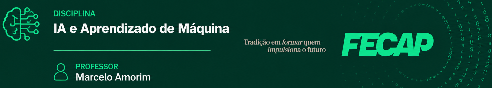

## Aula 07 - 29/09/2026

### Introdução a Redes Neurais Artificiais

* Introdução a Redes Neurais Artificiais [Slides](./AulaRedesNeurais.pdf)
* Dataset [dataset_alunos.csv](./dataset_alunos.csv)

## Prática

* Atividade [Atividade](./PraticaRedesNeurais.pdf)
* Dataset [desempenho_alunos.csv](./desempenho_alunos.csv)
* Dataset [desempenho_final.csv](./desempenho_final.csv)
* [Código Python da aula](./Gabarito_PraticaRedesNeurais.ipynb)
