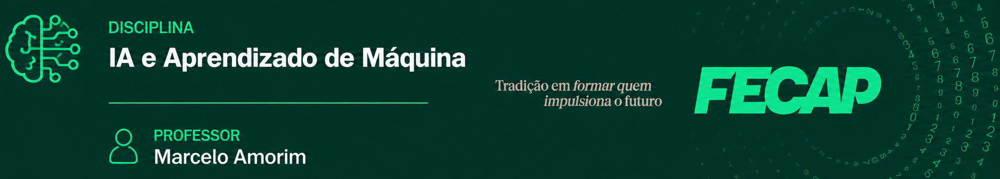

### FECAP - IA e Aprendizagem de Máquina - 2026/2 - 5CC 

### Link deste repositório: https://github.com/mmamorim/FECAP-IA-AM-2026-2

[Abrir Aula 01 no Colab](https://colab.research.google.com/github/mmamorim/FECAP-IA-AM-2026-2/blob/main/teste01.ipynb)

* [Aula 01](./Aula01//) (03/08) 
    - Apresentação da Disciplina
    - Mão na massa Python